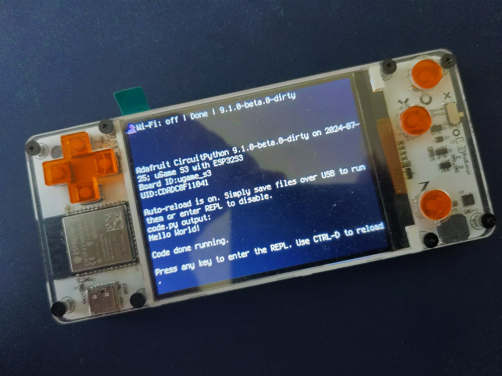

# uGame-S3

This is a design for a handheld game console.

 * case — design files for the front plate and buttons
 * circuitpython — board definition files for CircuitPython firmware
 * hardware — design files for the printed circuit board
 * images — photos and other images for this document
